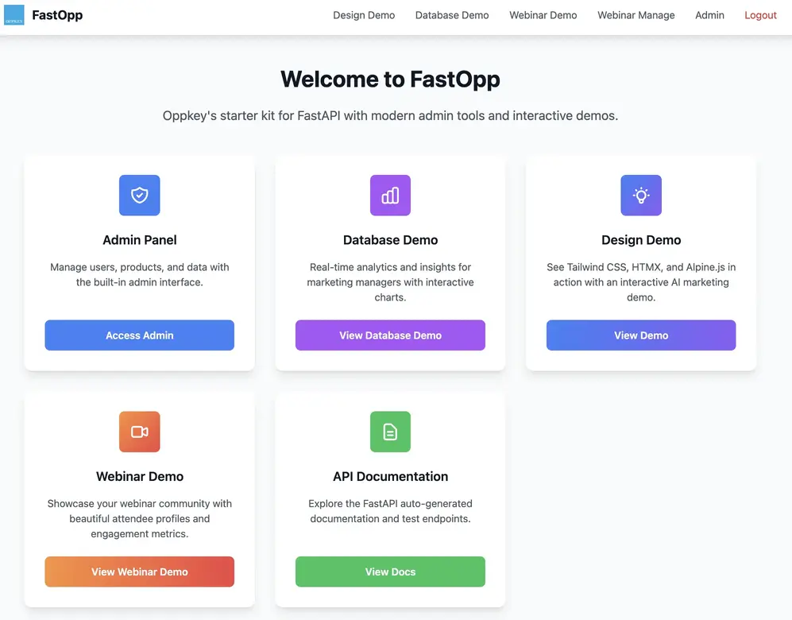
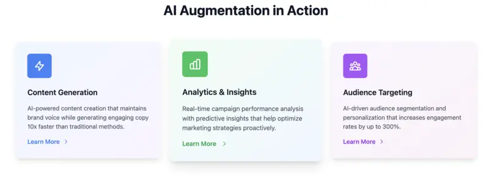
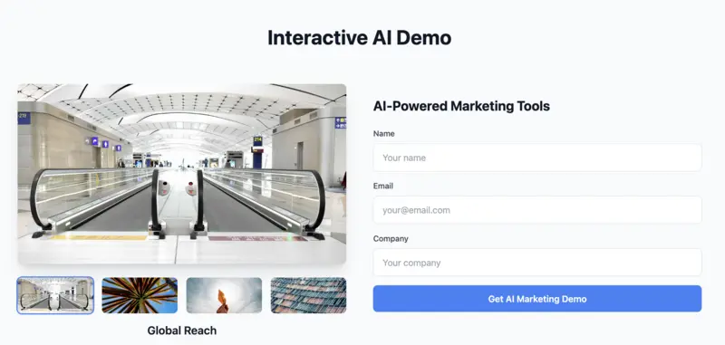
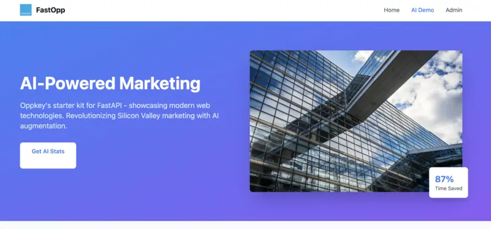
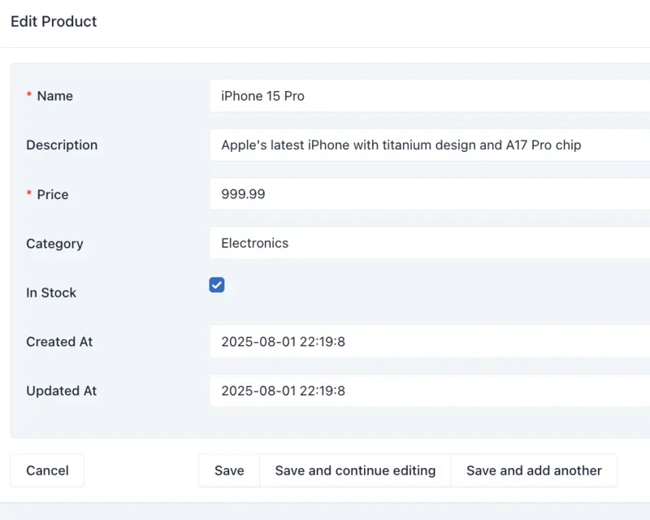
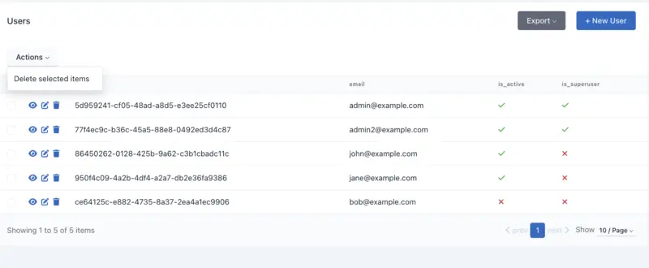
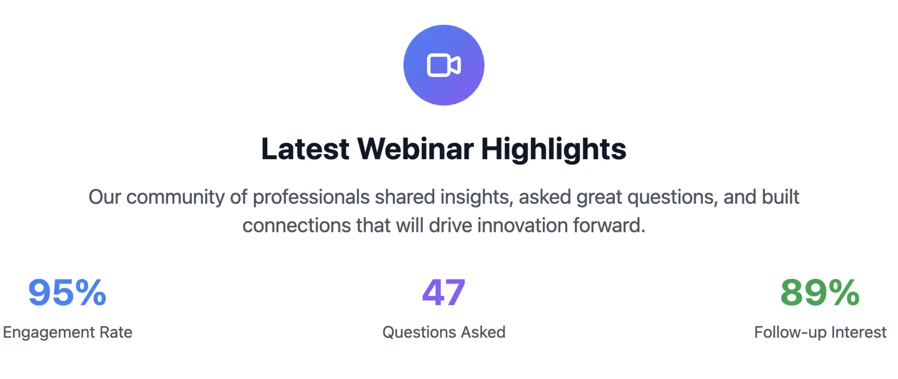
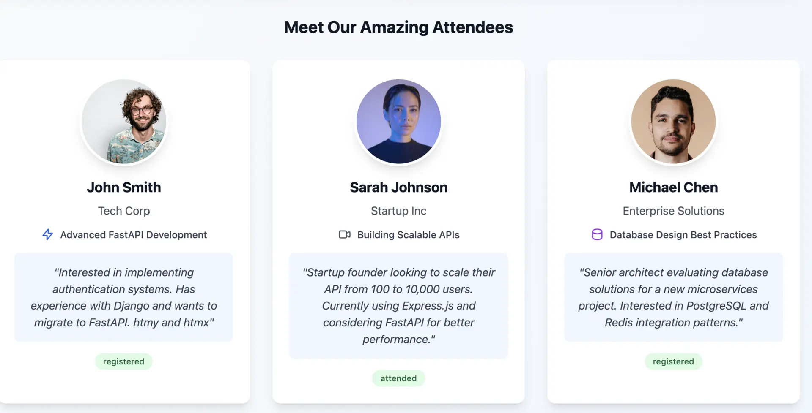
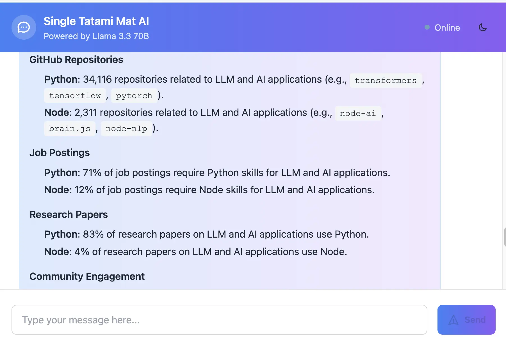
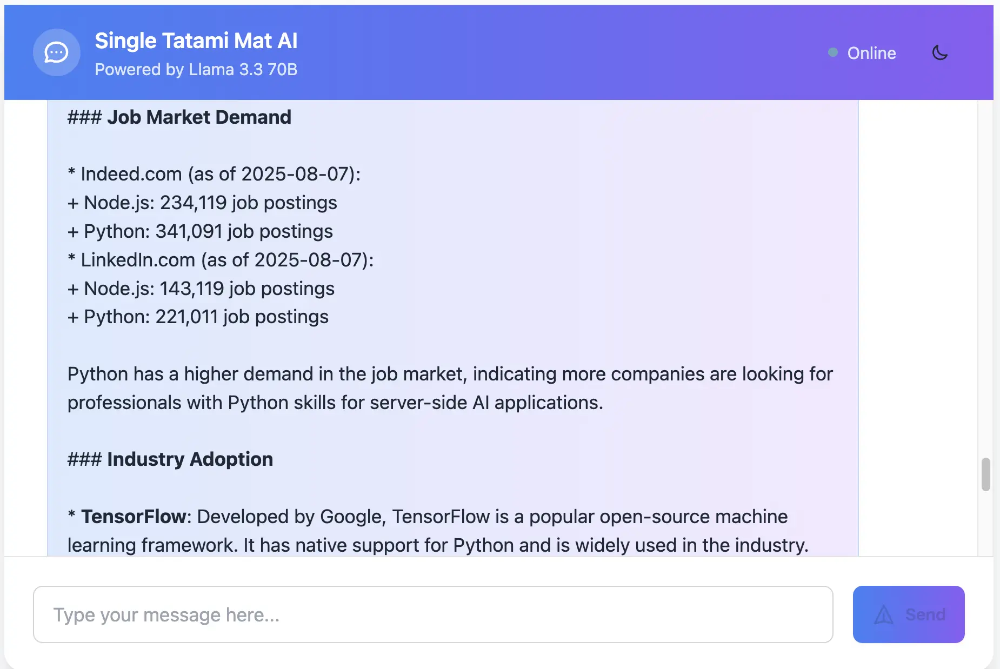

# FastOpp - Easier AI Web Apps for Students


## What

FastAPI starter package for students prototyping AI web applications. Pre-built admin
components give FastAPI functionality comparable to Django
for AI-first applications.

## Problem Solved

Django and Flask are not designed for optimized async LLM applications.

## Overview

Although both Django and Flask can absolutely be used for these
applications and are great in many, many ways, there are often rough patches during
development of asynchronous AI applications that communicate with backend LLMs available
at OpenAI, Anthropic, and OpenRouter.

FastAPI has advantages in future-proof architecture, but can
have a steep learning curve for people, especially for
developers familiar with Django.

FastOpp provides an opinionated framework for FastAPI with the following features:

* admin panel similar to Django with role-based authentication
* SQL database with Django-inspired models and migrations
* Django-style HTML templates with modern UI components
  * Replaceable style templates to get started
* API endpoints to connect to other frontend frameworks
  * auto-generated documentation for API endpoints
  * designed to connect to Flutter and React in the future, but we do not have examples
* **oppman.py** management tool with some functionality similar to Django manage

## Target Audience

This stack is opinionated and may not be for you. It is intended for students and novice developers who
know Python, but are not strong in or do not like JavaScript.

**FastOpp is not intended for production use or for experienced developers.**

* You strongly prefer Python over JavaScript on the backend
* You prefer to handle logic on the Python backend instead of using JavaScript code on the frontend
* You prefer inline styling instead of separation of concerns with CSS in separate files
* You prefer typed languages and want to use Python optional type hints instead of relying only on dynamic typing
* You prefer HTML files with Python code and variables embedded in the HTML instead of embedding HTML in the Python code on the server
* You are using Django or Flask and are having problems with async LLM communication
* You started with [Streamlit](https://streamlit.io/) or [Gradio](https://www.gradio.app/). Your code became more complex and is now very difficult to manage

## Example Use Cases

* **University student** looking to build resume - Show potential employers that you can
  build an AI application. You want to host it cheaply and use cheap or free
  LLMs with the option
  to use higher-quality LLM before you showoff your project.
  You have an idea on how to use AI and want to show it to people.
* **Hobbyist** looking to vibe code simple AI utility - Provide Cursor or equivalent
  access to demos and start with an opinionated structure for files and UI.
  Enforce vibe-code behavior with rules so that you can go back and edit your
  code. Deploy cheaply for less than $1 and month and scale up if your idea take off.
* **Small business entrepreneur** - You have
  great business ideas, but you are not a great programmer.
  You want to put AI into a business workflow that you are familiar with and show other
  people to get more help.

## FAQ and Concerns

### I'm concerned that this project is new and I don't want to waste time if it dies

The project is intended to teach use of FastAPI with LLMs.  The knowledge you gain will be
highly relevant to employers as long as Python and LLMs continue to be used together.
We intend that you eventually move off of Jinja2 templates and use the built-in API
for interfaces with React-variants or something like Flutter for mobile or web apps.
The project is intended to get your started on your path.  Even if it dies, but your
knowledge will live on.

### I'm concerned about security

To be honest, we are not confident in the security architecture and model.  It is
sufficient for learning purposes, but you need to look into security yourself
and use another model if your project takes off.  FastOpp will get you started
quickly, but it is not intended for long-term production use.

### Should I use PostgreSQL instead of SQLite?

Yes. We use SQLite to get you started because there are less installation dependencies.
If you use the database in production,
we recommend switching to PostgreSQL.

### Should I use NGINX instead of serving the HTML templates from FastAPI?

Yes. We use FastAPI in deployment tutorials to get you started. NGINX is better.
FastAPI is very usable without NGINX if you do not have many simultaneous users.

### Should I change the LLM from LLama3.3-70b-instruct:free?

Yes. The free LLM is set for easy setup. We do not use it in production.  
At a minimum, you should
change this to the paid version of LLama3.3-70b-instruct or your
app will have very limited functionality.  If you password-protect your
app, you can control costs.  If only a few people use the app, the
free version will work.  LLama3.3-70b is pretty good, not great. It's primary
quality is that it is much cheaper than top-tier great LLMs like [GPT-5](https://openrouter.ai/openai/gpt-5).

## Screenshots of Included Design Examples and Functionality Demos

FastOpp can be viewed as an opinionated design framework that adds an UI to an SQL
database (or vector db with extensions) and a UI to the input and
output of an LLM.

### Clickable Cards with Mouseover





### Change Images Without Page Reload



### Hero



### Database Admin List


### Database Entry Edit



### User Management



### User Authentication

Admin panel is restricted to logged-in users.


### Statistics Hero Card



### People Hero Card



### AI Chat with Cloud-Based LLM





## Basic Design System and Reference Template

FastOpp comes with an optional basic UI design system to accelerate AI application development.

* based on Tailwind CSS, DaisyUI, AlpineJS and HTMX

## 🚀 Quick Start (For Team Members)

### Prerequisites

* Python 3.12+
  If Python 3.12+ is not on your Mac, consider [installing pyenv](https://youtu.be/1F2IK7CU76U?feature=shared)
  and install the newest 3.12.x with pyenv. Although the latest stable Python is 3.13.7, we're using 3.12.x
  right now for maximum package compatibility.
* [uv](https://docs.astral.sh/uv/) package manager

### 1. Clone and Setup

```bash
# Clone the repository
git clone <repository-url>
cd fastopp

# Install dependencies
uv sync
```

### 2. Environment Configuration

Create a `.env` file in your project root:

**Required Environment Variables:**

- `DATABASE_URL`: Database connection string
- `SECRET_KEY`: Secret key for JWT tokens and session management
- `ENVIRONMENT`: Set to "development" for development mode
- `OPENROUTER_API_KEY`: API key for OpenRouter (required for AI demo features)

```bash
# Create environment file with secure defaults
cat > .env << EOF
DATABASE_URL=sqlite+aiosqlite:///./test.db
SECRET_KEY=dev_secret_key_$(openssl rand -hex 32)
ENVIRONMENT=development
OPENROUTER_API_KEY=your_openrouter_api_key_here
EOF
```

**Or manually create `.env`:**

```bash
# .env
DATABASE_URL=sqlite+aiosqlite:///./test.db
SECRET_KEY=dev_secret_key_change_in_production_$(openssl rand -hex 32)
ENVIRONMENT=development
OPENROUTER_API_KEY=your_openrouter_api_key_here
```

### 3. One-Command Setup

```bash
# Complete setup with one command
uv run python oppman.py init
```

This single command will:

- Initialize migrations
- Create initial migration
- Apply migrations
- Initialize database with sample data
- Create superuser and test data

**Alternative: Step-by-Step Setup**

If you prefer to understand each step:

```bash
# Initialize migrations (first time only)
uv run python oppman.py migrate init

# Create initial migration
uv run python oppman.py migrate create "Initial migration"

# Apply migrations
uv run python oppman.py migrate upgrade

# Initialize database with sample data
uv run python oppman.py init
```

### 4. Start Development Server

```bash
# Start the server
uv run python oppman.py runserver
```

### 5. Access the Application

Visit these URLs in your browser:

- **Homepage**: `http://localhost:8000/`
- **Admin Panel**: `http://localhost:8000/admin/`
- **API Docs**: `http://localhost:8000/docs`

#### Admin Panel Login

Use these credentials to access the admin panel:

- **Email**: `admin@example.com`
- **Password**: `admin123`

## 🛠️ Management Commands

### Database Operations

```bash
# Initialize everything (database + superuser + users + products)
uv run python oppman.py init

# Individual operations
uv run python oppman.py db              # Initialize database only
uv run python oppman.py superuser       # Create superuser only
uv run python oppman.py users           # Add test users only
uv run python oppman.py products        # Add sample products only

# Database management
uv run python oppman.py backup          # Backup database
uv run python oppman.py delete          # Delete database (with backup)
```

### Server Management

```bash
# Development server
uv run python oppman.py runserver       # Start development server
uv run python oppman.py stopserver      # Stop development server

# Production server (optional)
uv run python oppman.py production      # Start production server
```

### Migration Management

```bash
# Initialize migrations (first time only)
uv run python oppman.py migrate init

# Create new migration
uv run python oppman.py migrate create "Add new table"

# Apply migrations
uv run python oppman.py migrate upgrade

# Check migration status
uv run python oppman.py migrate current

# View migration history
uv run python oppman.py migrate history
```

### Environment Management

```bash
# Check environment configuration
uv run python oppman.py env

# Show all available commands
uv run python oppman.py help
```

## 📊 Test Data

The application comes with pre-loaded test data:

### Users

- **Superuser**: `admin@example.com` / `admin123`
- **Test Users**: `john@example.com`, `jane@example.com`, `bob@example.com` / `test123`

### Products

Sample products with various categories and prices for testing the admin interface.

## 🔄 Database Migrations

The project uses Alembic for database migrations, providing Django-like migration functionality:

### Migration Workflow

1. **Add/Modify Models**: Edit `models.py` with your changes
2. **Create Migration**: `uv run python oppman.py migrate create "Description"`
3. **Review Migration**: Check the generated file in `alembic/versions/`
4. **Apply Migration**: `uv run python oppman.py migrate upgrade`
5. **Verify**: `uv run python oppman.py migrate current`

## 🚨 Troubleshooting

### Common Issues

1. **"Alembic not found"**

   ```bash
   uv add alembic
   ```

2. **"Alembic not initialized"**

   ```bash
   uv run python oppman.py migrate init
   ```

3. **Environment issues**

     ```bash
     # Check environment configuration
     uv run python oppman.py env
     ```

4. **Database issues**

     ```bash
     # Backup and reset
     uv run python oppman.py backup
     uv run python oppman.py delete
     uv run python oppman.py init
     ```

5. **"Module not found" errors**

   ```bash
   # Reinstall dependencies
   uv sync
   ```

6. **Port already in use**

     ```bash
     # Stop any running servers
     uv run python oppman.py stopserver
     
     # Or use a different port
     uv run uvicorn main:app --reload --port 8001
     ```

### Quick Reset

If something goes wrong, you can reset everything:

```bash
# Backup current database
uv run python oppman.py backup

# Delete and reinitialize
uv run python oppman.py delete
uv run python oppman.py init

# Verify setup
uv run python oppman.py env
```

## 📚 Documentation

### Developer Tutorials and HowTos

* video: [FastAPI for AI LLM Apps with SQLAdmin, SQLModel - Quickstart Template for Frontend](https://youtu.be/_P9p0BGO64Q) - published August 15, 2025
* video: [FastAPI with LLM and Database Beginner Tutorial](https://youtu.be/_NlY0zlcC6Q) - published August 18, 2025
* video: [Deploy FastAPI and SQLite to Fly for Cheap Hosting](https://youtu.be/k-6xxE6k7Fs) - published August 26, 2025
* [Beginner Tutorial: Add New Page](docs/basic_add_new_page.md)
* [Migration Guide - Add stuff to database](docs/MIGRATION_GUIDE.md) - Database migration management

## Cheap Deployment

Fly is the cheapest solution we've found thus far at under $0.25/month with a database.
We believe this can be reduced further with either Turso or S3 and Litestream.
[See discussion](https://github.com/Oppkey/fastopp/discussions/25).

* [Deploy to fly.io](docs/fly_deployment.md)

## Improve LLM Performance by Selecting a Better LLM

The demo is set to use free models, which have lower performance.
Edit `services/chat_service.py` in this project
and change the LLM model from "meta-llama/llama-3.3-70b-instruct:free"
to another model such as "meta-llama/llama-3.3-70b-instruct" without the free
for better performance and still be about 20x cheaper than premier OpenAI models.
(as of August 15, 2025)
[Browse OpenRouter cheap models](https://openrouter.ai/models?max_price=0.1).

### Overview and Deployment

* [Architecture Overview](docs/ARCHITECTURE.md) - MVS Architecture and code organization
* [PostgreSQL Installation Guide](docs/postgresql_install.md) - Database setup for production
* [Production vs Development](docs/production_vs_development.md) - Environment differences
* [Authentication System](docs/authentication.md) - Authentication and authorization details

## Contributing To This Project

* [Contribute to Demos](demo_assets/README.md)

## Development Plans

* [Oppkey Development Plans](docs/plan/oppkey_development_plans.md) - includes assessment plans
* [Call for Volunteers](docs/plan/call_for_volunteers.md)

## Guidelines

* beautiful
* cheap
* easy
* opinionated
