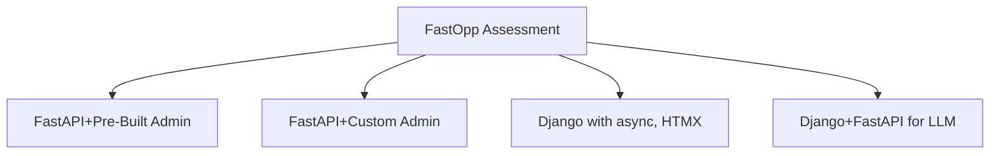

# FastOpp

FastAPI Oppkey starter package using pre-built admin
components to give FastAPI functionality comparable to Django.

The project is designed for Oppkey management (Jesse and Craig)
to assess FastAPI functionality.

The pre-built admin tools for FastAPI do not appear to be a
best practice or even popular among FastAPI developers.

After building applications with pre-built admin components, Oppkey
may eventually move from pre-built components to building
our own admin tools.

The tools could be a step in the process to evaluate FastAPI
or where Oppkey ends up.



## Components

| Functional Concept| Component | Django Equivalent |
| -- | -- | -- |
| Production Web Server | FastAPI | NGINX  |
| Development Web Server | uvicorn  | `manage.py runserver` in development. Django Framework |
| Development SQL Database | SQLite | SQLite |
| Production SQL Database | PostgreSQL with pgvector | PostgreSQL with pgvector |
| User Management | FastAPI Users | Django Admin |
| Database Management | SQLAdmin + Template | Django Admin |

## Project structure

```text
├── main.py
├── templates/index.html
├── db.py
├── models.py
├── users.py
├── init_db.py
├── create_superuser.py
├── test.db (auto-created)
├── pyproject.toml
└── uv.lock
```

## Setup

```text
uv run python init_db.py
uv run python create_superuser.py
```

## Checks

```bash
# run mypy and/or ruff on each file
uv run mypy db.py
# ruff is unrelated to mypy
uv run ruff check db.py
```
