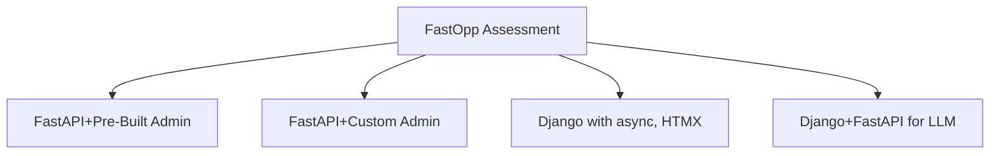

# FastOpp

FastAPI Oppkey starter package using pre-built admin
components to give FastAPI functionality comparable to Django.

The project is designed for Oppkey management (Jesse and Craig)
to assess FastAPI functionality.

The pre-built admin tools for FastAPI do not appear to be a
best practice or even popular among FastAPI developers.

After building applications with pre-built admin components, Oppkey
may eventually move from pre-built components to building
our own admin tools.

The tools could be a step in the process to evaluate FastAPI
or where Oppkey ends up.



## Components

| Functional Concept| Component | Django Equivalent |
| -- | -- | -- |
| Production Web Server | FastAPI | NGINX  |
| Development Web Server | uvicorn  | `manage.py runserver` in development. Django Framework |
| Development SQL Database | SQLite | SQLite |
| Production SQL Database | PostgreSQL with pgvector | PostgreSQL with pgvector |
| User Management | FastAPI Users | Django Admin |
| Database Management | SQLAdmin + Template | Django Admin |
| Authentication | Custom JWT + Session Auth | Django Admin Auth |

## Project structure

```text
├── main.py                 # FastAPI application with routes
├── auth.py                 # JWT authentication system
├── admin_auth.py           # SQLAdmin authentication backend
├── templates/index.html    # Jinja2 templates
├── db.py                   # Database configuration
├── models.py               # SQLAlchemy models
├── users.py                # FastAPI Users configuration
├── init_db.py              # Database initialization
├── create_superuser.py     # Superuser creation script
├── test.db                 # SQLite database (auto-created)
├── pyproject.toml          # Project dependencies
└── uv.lock                 # Lock file
```

## Setup

### 1. Install Dependencies

```bash
uv sync
```

### 2. Initialize Database

```bash
uv run python init_db.py
```

### 3. Create Superuser

```bash
uv run python create_superuser.py
```

This creates a superuser with:
- **Email**: `admin@example.com`
- **Password**: `admin123`

### 4. Start the Application

```bash
uv run uvicorn main:app --reload --host 0.0.0.0 --port 8000
```

## Authentication System

This FastAPI application includes a comprehensive authentication system with both web-based and API authentication.

### Admin Panel Authentication

The admin panel uses session-based authentication similar to Django's admin interface.

#### Access Admin Panel

1. **Visit**: http://localhost:8000/admin/
2. **Login with**:
   - Username: `admin@example.com`
   - Password: `admin123`

#### Features

- ✅ **Session-based authentication**
- ✅ **Secure password verification**
- ✅ **Superuser permission checking**
- ✅ **Database user lookup**
- ✅ **User management interface**

### API Authentication

The application provides JWT-based authentication for API access.

#### Get Authentication Token

```bash
curl -X POST http://localhost:8000/login \
  -u "admin@example.com:admin123" \
  -H "Content-Type: application/json"
```

**Response**:
```json
{
  "access_token": "eyJhbGciOiJIUzI1NiIsInR5cCI6IkpXVCJ9...",
  "token_type": "bearer"
}
```

#### Use Token for API Calls

```bash
curl -H "Authorization: Bearer YOUR_TOKEN_HERE" \
  http://localhost:8000/admin/
```

### Authentication Endpoints

| Endpoint | Method | Description | Auth Required |
|----------|--------|-------------|---------------|
| `/` | GET | Homepage | No |
| `/admin/` | GET | Admin panel | Yes (Session) |
| `/login` | POST | Get JWT token | Basic Auth |
| `/docs` | GET | API documentation | No |

## Available Features

### 1. **Admin Panel** (http://localhost:8000/admin/)
- Django-like admin interface
- User management (create, edit, delete)
- Database record management
- Session-based authentication

### 2. **API Documentation** (http://localhost:8000/docs)
- Interactive Swagger UI
- Auto-generated from FastAPI code
- Test endpoints directly

### 3. **User Management**
- User registration and authentication
- Password hashing with FastAPI Users
- Superuser permissions
- Active/inactive user status

### 4. **Database Integration**
- SQLAlchemy ORM
- SQLite for development
- Async database operations
- Alembic migrations support

## Security Features

- ✅ **JWT token authentication** for APIs
- ✅ **Session-based authentication** for admin panel
- ✅ **Password hashing** with Argon2
- ✅ **Superuser permission checking**
- ✅ **Database user verification**
- ✅ **Secure session management**

## Development

### Code Quality Checks

```bash
# Type checking with mypy
uv run mypy db.py
uv run mypy main.py
uv run mypy auth.py

# Linting with ruff
uv run ruff check db.py
uv run ruff check main.py
uv run ruff check auth.py
```

### Adding New Models

1. **Define model** in `models.py`
2. **Create admin view** in `main.py`
3. **Run database migration** (if using Alembic)

### Customizing Authentication

The authentication system is modular:

- **`auth.py`**: JWT token authentication
- **`admin_auth.py`**: SQLAdmin authentication backend
- **`main.py`**: Login endpoints and admin configuration

## Production Considerations

1. **Change default secrets**:
   - Update `SECRET_KEY` in `auth.py`
   - Update session secret in `main.py`

2. **Use environment variables**:
   ```python
   import os
   SECRET_KEY = os.getenv("SECRET_KEY", "default-secret")
   ```

3. **Database**: Switch from SQLite to PostgreSQL
4. **HTTPS**: Configure SSL/TLS certificates
5. **Rate limiting**: Add request rate limiting
6. **Logging**: Configure proper logging

## Troubleshooting

### Common Issues

1. **Module not found errors**: Run `uv sync` to install dependencies
2. **Database errors**: Run `uv run python init_db.py` to recreate database
3. **Authentication fails**: Check if superuser exists with `uv run python create_superuser.py`
4. **Port already in use**: Change port with `--port 8001`

### Reset Database

```bash
rm test.db
uv run python init_db.py
uv run python create_superuser.py
```
