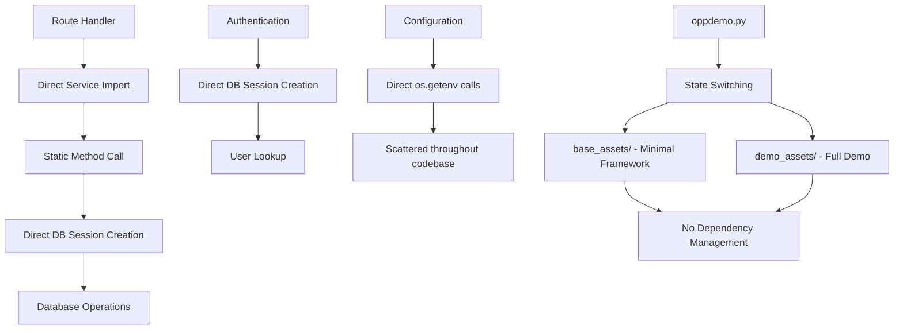
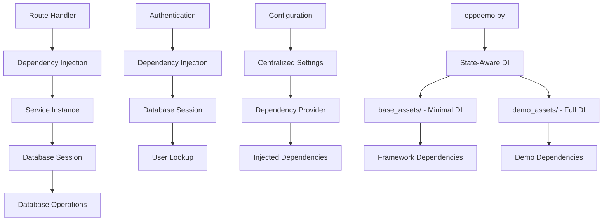

# FastAPI Dependency Injection Refactoring Plan

Last Updated Sept 18, 2025

## Overview

We are planning to refactor FastOpp to use FastAPI's dependency injection system. The refactoring will improve testability, maintainability, and follow FastAPI best practices.

## ✅ Phase 1A Completion Summary (Sept 18, 2025)

**Status**: COMPLETED ✅

**What was accomplished**:
- Created complete dependency injection infrastructure
- Implemented configuration management with `dependencies/config.py`
- Built database dependency system with `dependencies/database.py`
- Created service dependency provider with `dependencies/services.py`
- Refactored `ProductService` to use constructor injection
- Updated `/api/products` route to use dependency injection
- Modified `main.py` to use dependency setup
- Successfully tested the complete system - `/api/products` endpoint working with DI

**Key achievements**:
- ✅ Dependency injection is fully functional
- ✅ Database sessions properly managed
- ✅ Configuration centralized and type-safe
- ✅ Service instantiation via DI working
- ✅ No breaking changes to existing functionality
- ✅ Ready for Phase 1B expansion

## Current State

### Issues Identified

1. **Direct Database Session Creation**: Routes and services directly create `AsyncSessionLocal()` sessions
2. **Service Instantiation**: Services are imported and called statically within route handlers
3. **Configuration Scattered**: Environment variables and configuration are accessed directly throughout the codebase
4. **Authentication Dependencies**: Authentication logic is tightly coupled with database access
5. **No Dependency Lifecycle Management**: No proper setup/teardown of dependencies
6. **Hard to Test**: Difficult to mock dependencies for unit testing
7. **Code Duplication**: Database session creation is repeated across multiple files
8. **Framework State Management**: `oppdemo.py` system needs dependency-aware state switching
9. **Dual-Mode Architecture**: Base framework and full demo require different dependency configurations

### Current Architecture Problems



## Target Architecture

### Dependency Injection Flow



## Framework State Management Integration

### Understanding the Dual-Mode Architecture

The FastOpp project uses a sophisticated framework management system via `oppdemo.py`:

- **Base Framework** (`base_assets/`): Minimal FastAPI application with core functionality
- **Full Demo** (`demo_assets/`): Complete demonstration application with all features
- **Active Development**: Project root serves as the working directory

### State Switching Operations

1. **`oppdemo.py destroy`**: Switches to minimal framework (base_assets/)
2. **`oppdemo.py restore`**: Switches to full demo (demo_assets/)
3. **`oppdemo.py save`**: Saves current demo state to demo_assets/
4. **`oppdemo.py diff`**: Compares current vs saved state

### Dependency Injection Requirements for State Management

The refactoring must account for:

1. **State-Aware Dependencies**: Different dependency configurations for framework vs demo
2. **Service Lifecycle Management**: Proper setup/teardown when switching states
3. **Configuration Management**: Different settings for each state
4. **Testing Integration**: Mock dependencies for both states
5. **Backup and Recovery**: Preserve dependency configurations during state changes

## Refactoring Plan

### Phase 1A: Foundation & Quick Wins (Week 1)

#### 1.1 Create Basic Dependency Infrastructure

**Purpose**: Establish the foundation for dependency injection

**Implementation**:

```bash
mkdir -p dependencies
touch dependencies/__init__.py
```

#### 1.2 Simplified Configuration Dependencies (`dependencies/config.py`)

**Purpose**: Start with minimal, working configuration system

**Implementation**:

```python
from pydantic import BaseSettings
from typing import Optional

class Settings(BaseSettings):
    # Core settings only - start simple
    database_url: str = "sqlite+aiosqlite:///./test.db"
    secret_key: str = "dev_secret_key_change_in_production"
    environment: str = "development"
    
    # Optional settings for later phases
    access_token_expire_minutes: int = 30
    upload_dir: str = "static/uploads"
    openrouter_api_key: Optional[str] = None
    
    class Config:
        env_file = ".env"
        case_sensitive = False

def get_settings() -> Settings:
    """Dependency to get application settings"""
    return Settings()
```

**Benefits**:

- Quick implementation
- Immediate value
- Easy to extend later
- Validates the approach

#### 1.3 Database Dependencies (`dependencies/database.py`)

**Purpose**: Manage database connections and sessions

**Implementation**:
```python
from fastapi import Depends
from sqlalchemy.ext.asyncio import AsyncSession, async_sessionmaker
from sqlalchemy import create_async_engine
from .config import Settings, get_settings

def create_database_engine(settings: Settings):
    """Create database engine from settings"""
    return create_async_engine(
        settings.database_url,
        echo=settings.environment == "development",
        future=True
    )

def create_session_factory(engine):
    """Create session factory from engine"""
    return async_sessionmaker(
        bind=engine,
        class_=AsyncSession,
        expire_on_commit=False,
        autoflush=False,
        autocommit=False
    )

async def get_db_session(
    session_factory: async_sessionmaker = Depends(create_session_factory)
) -> AsyncSession:
    """Dependency to get database session"""
    async with session_factory() as session:
        try:
            yield session
        finally:
            await session.close()
```

**Benefits**:
- Proper session lifecycle management
- Connection pooling
- Easy to mock for testing
- Centralized database configuration

#### 1.4 Proof of Concept Service Dependency (`dependencies/services.py`)

**Purpose**: Create one service dependency to validate the approach

**Implementation**:
```python
from fastapi import Depends
from sqlalchemy.ext.asyncio import AsyncSession
from .database import get_db_session
from .config import Settings, get_settings

def get_product_service(
    session: AsyncSession = Depends(get_db_session),
    settings: Settings = Depends(get_settings)
):
    """Dependency to get ProductService instance - PROOF OF CONCEPT"""
    from services.product_service import ProductService
    return ProductService(session=session, settings=settings)

# Note: Other services will be added in Phase 1B
```

**Benefits**:
- Validates the dependency injection approach
- Low risk implementation
- Easy to test and debug
- Quick win demonstration

#### 1.5 Update One Route Handler (Proof of Concept)

**Purpose**: Validate dependency injection with one API endpoint

**Current Pattern**:
```python
@router.get("/products")
async def get_products():
    from services.product_service import ProductService
    data = await ProductService.get_products_with_stats()
    return JSONResponse(data)
```

**Refactored Pattern**:
```python
@router.get("/products")
async def get_products(
    product_service = Depends(get_product_service)
):
    data = await product_service.get_products_with_stats()
    return JSONResponse(data)
```

**Benefits**:
- Immediate validation of the approach
- Low risk change
- Easy to test and debug
- Demonstrates working dependency injection

### Phase 1B: Service Refactoring (Week 2)

#### 1.6 Refactor ProductService to Use Constructor Injection

**Purpose**: Convert ProductService to use dependency injection

**Current Pattern**:
```python
class ProductService:
    @staticmethod
    async def get_products_with_stats():
        async with AsyncSessionLocal() as session:
            # Database operations
```

**Refactored Pattern**:
```python
class ProductService:
    def __init__(self, session: AsyncSession, settings: Settings):
        self.session = session
        self.settings = settings
    
    async def get_products_with_stats(self):
        # Database operations using self.session
```

**Files to Refactor**:
- `services/product_service.py` (only this one initially)

#### 1.7 Update Application Factory

**Purpose**: Create a simple application factory that works with the new system

**Implementation**:
```python
# main.py - Add dependency setup
from dependencies.database import create_database_engine, create_session_factory
from dependencies.config import get_settings

def setup_dependencies(app: FastAPI):
    """Setup application dependencies"""
    settings = get_settings()
    engine = create_database_engine(settings)
    session_factory = create_session_factory(engine)
    
    # Store in app state
    app.state.db_engine = engine
    app.state.session_factory = session_factory
    app.state.settings = settings

# Add to app creation
app = FastAPI()
setup_dependencies(app)
```

### Phase 1C: Testing & Validation (Week 3)

#### 1.8 Create Basic Test Infrastructure

**Purpose**: Validate the dependency injection is working

**Implementation**:
```python
# tests/test_dependencies.py
import pytest
from fastapi.testclient import TestClient
from main import app

def test_product_endpoint():
    """Test that the refactored product endpoint works"""
    client = TestClient(app)
    response = client.get("/products")
    assert response.status_code == 200
    # This validates dependency injection is working
```

#### 1.9 Validate State Switching

**Purpose**: Ensure `oppdemo.py` still works with the new dependency system

**Implementation**:
- Test `oppdemo.py destroy` and `oppdemo.py restore` commands
- Verify application still works in both states
- Ensure no breaking changes to existing functionality

#### 3.2 Template Dependencies

**Purpose**: Inject template dependencies

**Implementation**:
```python
# dependencies/templates.py
from fastapi import Depends
from fastapi.templating import Jinja2Templates
from .config import Settings, get_settings

def get_templates(settings: Settings = Depends(get_settings)) -> Jinja2Templates:
    """Dependency to get Jinja2Templates instance"""
    return Jinja2Templates(directory="templates")
```

### Phase 4: Update Authentication System

#### 4.1 Authentication Dependencies (`dependencies/auth.py`)

**Purpose**: Centralize authentication logic

**Implementation**:
```python
from fastapi import Depends, HTTPException, Request
from sqlalchemy.ext.asyncio import AsyncSession
from sqlmodel import select
from .database import get_db_session
from .config import get_settings
from models import User
import jwt
import uuid

async def get_current_user_from_cookies(
    request: Request,
    session: AsyncSession = Depends(get_db_session),
    settings = Depends(get_settings)
) -> User:
    """Get current authenticated user from cookies"""
    token = request.cookies.get("access_token")
    if not token:
        raise HTTPException(status_code=401, detail="Not authenticated")
    
    try:
        payload = jwt.decode(token, settings.secret_key, algorithms=["HS256"])
        user_id = payload.get("sub")
        if not user_id:
            raise HTTPException(status_code=401, detail="Invalid token")
        
        user_uuid = uuid.UUID(user_id)
        result = await session.execute(select(User).where(User.id == user_uuid))
        user = result.scalar_one_or_none()
        
        if not user or not user.is_active:
            raise HTTPException(status_code=401, detail="User not found or inactive")
        
        return user
    except (jwt.PyJWTError, ValueError):
        raise HTTPException(status_code=401, detail="Invalid token")

async def get_current_staff_or_admin(
    current_user: User = Depends(get_current_user_from_cookies)
) -> User:
    """Get current authenticated user with staff or admin permissions"""
    if not (current_user.is_staff or current_user.is_superuser):
        raise HTTPException(status_code=403, detail="Not enough permissions")
    return current_user
```

#### 4.2 JWT and Session Management

**Purpose**: Centralize token management

**Implementation**:
```python
# dependencies/jwt.py
from fastapi import Depends
from .config import Settings, get_settings
import jwt
from datetime import datetime, timedelta

def create_access_token(
    data: dict, 
    settings: Settings = Depends(get_settings)
) -> str:
    """Create JWT access token"""
    to_encode = data.copy()
    expire = datetime.utcnow() + timedelta(minutes=settings.access_token_expire_minutes)
    to_encode.update({"exp": expire})
    return jwt.encode(to_encode, settings.secret_key, algorithm="HS256")

def verify_token(
    token: str,
    settings: Settings = Depends(get_settings)
) -> dict:
    """Verify JWT token"""
    try:
        payload = jwt.decode(token, settings.secret_key, algorithms=["HS256"])
        return payload
    except jwt.PyJWTError:
        return None
```

### Phase 5: Framework State Management Integration

#### 5.1 State-Aware Dependency Providers (`dependencies/state.py`)

**Purpose**: Create dependency providers that work with both framework and demo states

**Implementation**:
```python
# dependencies/state.py
from enum import Enum
from typing import Dict, Any
from pathlib import Path
from .config import Settings, get_settings

class ApplicationState(Enum):
    FRAMEWORK = "framework"  # base_assets/ - minimal
    DEMO = "demo"           # demo_assets/ - full

def detect_application_state() -> ApplicationState:
    """Detect current application state based on file structure"""
    # Check if we're in framework mode (minimal)
    if Path("base_assets").exists() and not Path("services").exists():
        return ApplicationState.FRAMEWORK
    
    # Check if we're in demo mode (full)
    if Path("services").exists() and Path("demo_assets").exists():
        return ApplicationState.DEMO
    
    # Default to demo mode for development
    return ApplicationState.DEMO

def get_framework_dependencies(settings: Settings = Depends(get_settings)):
    """Get minimal dependencies for framework state"""
    return {
        "services": [],  # No business logic services
        "routes": ["auth", "pages"],  # Basic routes only
        "templates": ["index", "login", "protected"],  # Basic templates
        "static": False,  # No static assets
    }

def get_demo_dependencies(settings: Settings = Depends(get_settings)):
    """Get full dependencies for demo state"""
    return {
        "services": ["chat", "product", "webinar"],  # All services
        "routes": ["auth", "pages", "api", "chat", "webinar"],  # All routes
        "templates": ["index", "login", "protected", "ai-demo", "database-demo", "design-demo", "webinar-demo"],  # All templates
        "static": True,  # Full static assets
    }

def get_state_dependencies(
    state: ApplicationState = Depends(detect_application_state),
    settings: Settings = Depends(get_settings)
):
    """Get dependencies based on current application state"""
    if state == ApplicationState.FRAMEWORK:
        return get_framework_dependencies(settings)
    else:
        return get_demo_dependencies(settings)
```

#### 5.2 State-Aware Service Dependencies (`dependencies/services.py`)

**Purpose**: Create service dependencies that work with both states

**Implementation**:
```python
# dependencies/services.py
from fastapi import Depends
from sqlalchemy.ext.asyncio import AsyncSession
from .database import get_db_session
from .config import Settings, get_settings
from .state import ApplicationState, detect_application_state

def get_product_service(
    session: AsyncSession = Depends(get_db_session),
    settings: Settings = Depends(get_settings),
    state: ApplicationState = Depends(detect_application_state)
):
    """Dependency to get ProductService instance (demo only)"""
    if state == ApplicationState.DEMO:
        from services.product_service import ProductService
        return ProductService(session=session, settings=settings)
    return None

def get_webinar_service(
    session: AsyncSession = Depends(get_db_session),
    settings: Settings = Depends(get_settings),
    state: ApplicationState = Depends(detect_application_state)
):
    """Dependency to get WebinarService instance (demo only)"""
    if state == ApplicationState.DEMO:
        from services.webinar_service import WebinarService
        return WebinarService(session=session, settings=settings)
    return None

def get_chat_service(
    settings: Settings = Depends(get_settings),
    state: ApplicationState = Depends(detect_application_state)
):
    """Dependency to get ChatService instance (demo only)"""
    if state == ApplicationState.DEMO:
        from services.chat_service import ChatService
        return ChatService(settings=settings)
    return None
```

#### 5.3 State-Aware Route Dependencies (`dependencies/routes.py`)

**Purpose**: Create route dependencies that work with both states

**Implementation**:
```python
# dependencies/routes.py
from fastapi import APIRouter, Depends
from .state import ApplicationState, detect_application_state

def get_framework_routes():
    """Get minimal routes for framework state"""
    from routes.auth import router as auth_router
    from routes.pages import router as pages_router
    return [auth_router, pages_router]

def get_demo_routes():
    """Get full routes for demo state"""
    from routes.auth import router as auth_router
    from routes.pages import router as pages_router
    from routes.api import router as api_router
    from routes.chat import router as chat_router
    from routes.webinar import router as webinar_router
    return [auth_router, pages_router, api_router, chat_router, webinar_router]

def get_state_routes(state: ApplicationState = Depends(detect_application_state)):
    """Get routes based on current application state"""
    if state == ApplicationState.FRAMEWORK:
        return get_framework_routes()
    else:
        return get_demo_routes()
```

### Phase 6: Application Configuration

#### 6.1 State-Aware Application Factory (`main.py`)

**Purpose**: Create application factory that works with both states

**Implementation**:
```python
from fastapi import FastAPI
from dependencies.database import create_database_engine, create_session_factory
from dependencies.config import get_settings
from dependencies.state import detect_application_state, get_state_routes
from admin.setup import setup_admin

def create_app() -> FastAPI:
    """Application factory with state awareness"""
    app = FastAPI()
    
    # Get settings
    settings = get_settings()
    
    # Create database engine and session factory
    engine = create_database_engine(settings)
    session_factory = create_session_factory(engine)
    
    # Store in app state for dependency injection
    app.state.db_engine = engine
    app.state.session_factory = session_factory
    app.state.settings = settings
    
    # Setup admin
    setup_admin(app, settings.secret_key)
    
    # Include state-aware routers
    routes = get_state_routes()
    for route in routes:
        app.include_router(route)
    
    return app

app = create_app()
```

#### 6.2 State-Aware Admin Setup (`admin/setup.py`)

**Purpose**: Update admin setup to work with both states

**Implementation**:
```python
# admin/setup.py
from fastapi import FastAPI
from dependencies.config import Settings
from dependencies.state import ApplicationState, detect_application_state

def setup_admin(app: FastAPI, settings: Settings):
    """Setup admin with state awareness"""
    # Get current state
    state = detect_application_state()
    
    if state == ApplicationState.FRAMEWORK:
        # Minimal admin setup
        from .views import UserAdmin
        admin.add_view(UserAdmin)
    else:
        # Full admin setup
        from .views import UserAdmin, ProductAdmin, WebinarRegistrantsAdmin, AuditLogAdmin
        admin.add_view(UserAdmin)
        admin.add_view(ProductAdmin)
        admin.add_view(WebinarRegistrantsAdmin)
        admin.add_view(AuditLogAdmin)
```

### Phase 7: Update oppdemo.py System

#### 7.1 State-Aware oppdemo.py Updates

**Purpose**: Update `oppdemo.py` to work with dependency injection system

**Implementation**:
```python
# oppdemo.py updates
from dependencies.state import ApplicationState, detect_application_state
from dependencies.config import get_settings

def save_demo_files():
    """Save demo files with dependency configuration"""
    print("🔄 Saving demo files to demo_assets...")
    
    # Save dependency configuration
    save_dependency_config()
    
    # ... existing save logic
    
    # Save state information
    state_info = {
        "state": "demo",
        "dependencies": get_demo_dependencies(),
        "timestamp": datetime.now().isoformat()
    }
    
    state_file = demo_assets / "state.json"
    with open(state_file, 'w') as f:
        json.dump(state_info, f, indent=2)

def restore_demo_files():
    """Restore demo files with dependency configuration"""
    print("🔄 Restoring demo files from backup...")
    
    # ... existing restore logic
    
    # Restore dependency configuration
    restore_dependency_config()
    
    # Verify state
    current_state = detect_application_state()
    if current_state != ApplicationState.DEMO:
        print("⚠️  Warning: State detection may be incorrect")

def destroy_demo_files():
    """Destroy demo files and switch to minimal framework"""
    print("🗑️  Destroying demo files and switching to minimal application...")
    
    # ... existing destroy logic
    
    # Verify state
    current_state = detect_application_state()
    if current_state != ApplicationState.FRAMEWORK:
        print("⚠️  Warning: State detection may be incorrect")
```

#### 7.2 Dependency Configuration Management

**Purpose**: Manage dependency configurations for different states

**Implementation**:
```python
# dependencies/state_config.py
import json
from pathlib import Path
from typing import Dict, Any
from .state import ApplicationState

def save_dependency_config(state: ApplicationState, config: Dict[str, Any]):
    """Save dependency configuration for a state"""
    config_dir = Path("dependencies/configs")
    config_dir.mkdir(exist_ok=True)
    
    config_file = config_dir / f"{state.value}_config.json"
    with open(config_file, 'w') as f:
        json.dump(config, f, indent=2)

def load_dependency_config(state: ApplicationState) -> Dict[str, Any]:
    """Load dependency configuration for a state"""
    config_dir = Path("dependencies/configs")
    config_file = config_dir / f"{state.value}_config.json"
    
    if config_file.exists():
        with open(config_file, 'r') as f:
            return json.load(f)
    return {}

def get_framework_dependency_config():
    """Get framework dependency configuration"""
    return {
        "services": [],
        "routes": ["auth", "pages"],
        "templates": ["index", "login", "protected"],
        "static": False,
        "admin_views": ["UserAdmin"]
    }

def get_demo_dependency_config():
    """Get demo dependency configuration"""
    return {
        "services": ["chat", "product", "webinar"],
        "routes": ["auth", "pages", "api", "chat", "webinar"],
        "templates": ["index", "login", "protected", "ai-demo", "database-demo", "design-demo", "webinar-demo"],
        "static": True,
        "admin_views": ["UserAdmin", "ProductAdmin", "WebinarRegistrantsAdmin", "AuditLogAdmin"]
    }
```

### Phase 8: Testing Infrastructure

#### 8.1 State-Aware Test Dependencies

**Purpose**: Create test-specific dependencies for both framework and demo states

**Implementation**:
```python
# tests/dependencies.py
from fastapi import FastAPI
from sqlalchemy.ext.asyncio import AsyncSession
from dependencies.database import get_db_session
from dependencies.config import get_settings
from dependencies.state import ApplicationState, detect_application_state

def create_test_app(state: ApplicationState = ApplicationState.DEMO) -> FastAPI:
    """Create test application with state-aware overridden dependencies"""
    app = FastAPI()
    
    # Override dependencies for testing
    app.dependency_overrides[get_db_session] = get_test_db_session
    app.dependency_overrides[get_settings] = get_test_settings
    app.dependency_overrides[detect_application_state] = lambda: state
    
    return app

async def get_test_db_session() -> AsyncSession:
    """Test database session"""
    # Use test database
    pass

def get_test_settings() -> Settings:
    """Test settings"""
    # Use test configuration
    pass

def create_framework_test_app() -> FastAPI:
    """Create test app for framework state"""
    return create_test_app(ApplicationState.FRAMEWORK)

def create_demo_test_app() -> FastAPI:
    """Create test app for demo state"""
    return create_test_app(ApplicationState.DEMO)
```

#### 8.2 State-Specific Testing

**Purpose**: Test both framework and demo states

**Implementation**:
```python
# tests/test_framework_state.py
import pytest
from fastapi.testclient import TestClient
from tests.dependencies import create_framework_test_app

def test_framework_state():
    """Test framework state functionality"""
    app = create_framework_test_app()
    client = TestClient(app)
    
    # Test framework-only routes
    response = client.get("/")
    assert response.status_code == 200
    
    # Test that demo routes are not available
    response = client.get("/ai-demo")
    assert response.status_code == 404

# tests/test_demo_state.py
import pytest
from fastapi.testclient import TestClient
from tests.dependencies import create_demo_test_app

def test_demo_state():
    """Test demo state functionality"""
    app = create_demo_test_app()
    client = TestClient(app)
    
    # Test demo routes
    response = client.get("/ai-demo")
    assert response.status_code == 200
    
    response = client.get("/database-demo")
    assert response.status_code == 200
```

## Implementation Timeline

### Phase 1A: Foundation & Quick Wins (Week 1) ✅ COMPLETED Sept 18, 2025
- [x] Create `dependencies/` directory structure
- [x] Implement simplified configuration dependencies
- [x] Implement database dependencies
- [x] Create proof of concept service dependency (ProductService only)
- [x] Update one route handler to use dependency injection
- [x] Update application factory with dependency setup

### Phase 1B: Service Refactoring (Week 2)
- [x] Refactor `ProductService` to use constructor injection ✅ COMPLETED Sept 18, 2025
- [ ] Add remaining service dependencies (WebinarService, ChatService)
- [ ] Refactor remaining service classes
- [ ] Update all route handlers to use dependency injection
- [ ] Test all endpoints work with new system

### Phase 1C: Testing & Validation (Week 3)
- [ ] Create basic test infrastructure
- [ ] Write tests for dependency injection
- [ ] Validate `oppdemo.py` state switching still works
- [ ] Performance testing to ensure no regressions
- [ ] Documentation updates

### Phase 2: Advanced Features (Week 4-5)
- [ ] Implement state detection system
- [ ] Add state-aware service dependencies
- [ ] Update `oppdemo.py` system for dependency injection
- [ ] Create state-aware application factory
- [ ] Add comprehensive testing for both states

### Phase 3: Authentication & Polish (Week 6)
- [ ] Refactor authentication system with dependency injection
- [ ] Add template dependencies
- [ ] Create repository pattern (optional)
- [ ] Final testing and validation
- [ ] Complete documentation

## Key Differences from Original Plan

### 1. **Incremental Approach**
- **Original**: Implement all dependencies at once
- **Revised**: Start with one service, validate, then expand

### 2. **Quick Wins First**
- **Original**: Complex state detection from day one
- **Revised**: Simple configuration, prove concept, then add complexity

### 3. **Risk Mitigation**
- **Original**: High risk, many changes at once
- **Revised**: Low risk, one change at a time with validation

### 4. **Immediate Value**
- **Original**: No working dependency injection until Phase 1 complete
- **Revised**: Working dependency injection in 1-2 days

### 5. **Simplified Configuration**
- **Original**: Complex settings class with all features
- **Revised**: Minimal settings, add features as needed

## Benefits of This Refactoring

### 1. Testability
- **Before**: Difficult to mock database sessions and services
- **After**: Easy to inject mock dependencies for unit testing

### 2. Maintainability
- **Before**: Tightly coupled code with scattered dependencies
- **After**: Clear separation of concerns with centralized dependency management

### 3. Configuration Management
- **Before**: Environment variables accessed directly throughout codebase
- **After**: Centralized configuration with validation and type safety

### 4. Resource Management
- **Before**: Manual session creation and cleanup
- **After**: Automatic lifecycle management with proper cleanup

### 5. Flexibility
- **Before**: Hard to swap implementations
- **After**: Easy to swap implementations or add new features

### 6. Type Safety
- **Before**: Limited type hints and IDE support
- **After**: Full type safety with better IDE support

### 7. Performance
- **Before**: Potential connection leaks and inefficient resource usage
- **After**: Proper connection pooling and resource management

### 8. Framework State Management
- **Before**: `oppdemo.py` system works without dependency awareness
- **After**: State-aware dependency injection with proper configuration management

### 9. Dual-Mode Architecture Support
- **Before**: Framework and demo states have no dependency management
- **After**: Clean separation with state-specific dependency configurations

### 10. Development Workflow
- **Before**: Manual state management without dependency tracking
- **After**: Automated state detection with proper dependency lifecycle management

## Migration Strategy

### 1. Gradual Migration
- Implement new dependency system alongside existing code
- Gradually migrate routes and services
- Remove old patterns once migration is complete

### 2. Backward Compatibility
- Maintain existing API contracts
- Ensure no breaking changes during migration
- Use feature flags if necessary

### 3. Testing Strategy
- Write tests for new dependency system
- Ensure existing functionality continues to work
- Performance testing to ensure no regressions

## File Structure After Refactoring

```
fastopp/
├── dependencies/
│   ├── __init__.py
│   ├── config.py              # Configuration dependencies
│   ├── database.py            # Database dependencies
│   ├── services.py            # Service dependencies
│   ├── auth.py               # Authentication dependencies
│   ├── jwt.py                # JWT dependencies
│   ├── templates.py          # Template dependencies
│   ├── state.py              # State detection and management
│   ├── routes.py             # Route dependencies
│   ├── state_config.py       # State configuration management
│   └── configs/              # State-specific configurations
│       ├── framework_config.json
│       └── demo_config.json
├── repositories/
│   ├── __init__.py
│   ├── base_repository.py
│   ├── product_repository.py
│   └── webinar_repository.py
├── services/
│   ├── __init__.py
│   ├── product_service.py    # Refactored with DI + state awareness
│   ├── webinar_service.py    # Refactored with DI + state awareness
│   └── chat_service.py       # Refactored with DI + state awareness
├── routes/
│   ├── __init__.py
│   ├── api.py              # Refactored with DI + state awareness
│   ├── auth.py             # Refactored with DI + state awareness
│   ├── pages.py            # Refactored with DI + state awareness
│   ├── chat.py             # Refactored with DI + state awareness
│   └── webinar.py          # Refactored with DI + state awareness
├── base_assets/            # Minimal framework state
│   ├── main.py
│   ├── routes/
│   ├── templates/
│   └── admin/
├── demo_assets/            # Full demo state
│   ├── main.py
│   ├── models.py
│   ├── routes/
│   ├── services/
│   ├── templates/
│   ├── static/
│   └── state.json          # State configuration
├── main.py                 # State-aware app factory
├── oppdemo.py             # Updated for DI + state management
├── oppman.py              # Core management (unchanged)
└── tests/
    ├── __init__.py
    ├── dependencies.py     # State-aware test dependencies
    ├── test_framework_state.py
    ├── test_demo_state.py
    └── test_*.py          # Updated tests
```

## Framework State Management Considerations

### State Detection Strategy

The refactored system uses file structure analysis to detect the current application state:

1. **Framework State**: Detected when `base_assets/` exists and `services/` directory is absent
2. **Demo State**: Detected when `services/` exists and `demo_assets/` directory is present
3. **Default**: Falls back to demo state for development

### Dependency Configuration Management

Each state maintains its own dependency configuration:

- **Framework State**: Minimal dependencies (auth, pages, basic admin)
- **Demo State**: Full dependencies (all services, routes, templates, static assets)
- **Configuration Files**: JSON files store state-specific dependency configurations

### State Switching with oppdemo.py

The `oppdemo.py` system is enhanced to work with dependency injection:

1. **`save`**: Saves current demo state including dependency configuration
2. **`restore`**: Restores demo state with proper dependency setup
3. **`destroy`**: Switches to framework state with minimal dependencies
4. **`diff`**: Compares current state with saved configuration

### Testing Both States

The refactored system supports testing both application states:

- **Framework Tests**: Test minimal functionality with basic dependencies
- **Demo Tests**: Test full functionality with all dependencies
- **State Switching Tests**: Test the transition between states
- **Integration Tests**: Test the complete workflow

## Immediate Next Steps

### Day 1: Foundation Setup
1. **Create dependencies directory**:

   ```bash
   mkdir -p dependencies
   touch dependencies/__init__.py
   ```

2. **Implement basic configuration** (`dependencies/config.py`):
   - Start with minimal Settings class
   - Add core database and security settings
   - Test configuration loading

3. **Implement database dependencies** (`dependencies/database.py`):
   - Create engine and session factory functions
   - Add database session dependency
   - Test database connection

### Day 2: Proof of Concept
1. **Create ProductService dependency** (`dependencies/services.py`):
   - Add get_product_service function
   - Test service creation

2. **Update one route handler** (`routes/api.py`):
   - Modify `/products` endpoint to use dependency injection
   - Test endpoint works with new system

3. **Update application factory** (`main.py`):
   - Add setup_dependencies function
   - Test application starts correctly

### Day 3: Service Refactoring
1. **Refactor ProductService** (`services/product_service.py`):
   - Convert to constructor injection
   - Update all methods to use self.session
   - Test all ProductService functionality

2. **Validate state switching**:
   - Test `oppdemo.py destroy` and `restore`
   - Ensure application works in both states

### Success Criteria for Phase 1A
- [ ] `/products` endpoint works with dependency injection
- [ ] ProductService uses constructor injection
- [ ] Database sessions are properly managed
- [ ] `oppdemo.py` state switching still works
- [ ] No breaking changes to existing functionality

## Conclusion

This revised refactoring plan transforms the FastOpp application from a tightly-coupled system to a well-architected, testable, and maintainable FastAPI application using an incremental, low-risk approach.

**Key Advantages of This Approach**:
- **Quick wins**: Working dependency injection in 1-2 days
- **Low risk**: One change at a time with validation
- **Immediate value**: See benefits before committing to full migration
- **Flexible**: Can stop and evaluate at any point
- **Backward compatible**: Existing code continues to work

The refactoring specifically addresses the unique requirements of the FastOpp framework's dual-mode architecture, ensuring that both the minimal framework and full demo states work seamlessly with proper dependency injection.

The end result will be a more robust, scalable, and maintainable codebase that is easier to test, extend, and modify, while preserving the sophisticated framework management capabilities of the `oppdemo.py` system.
